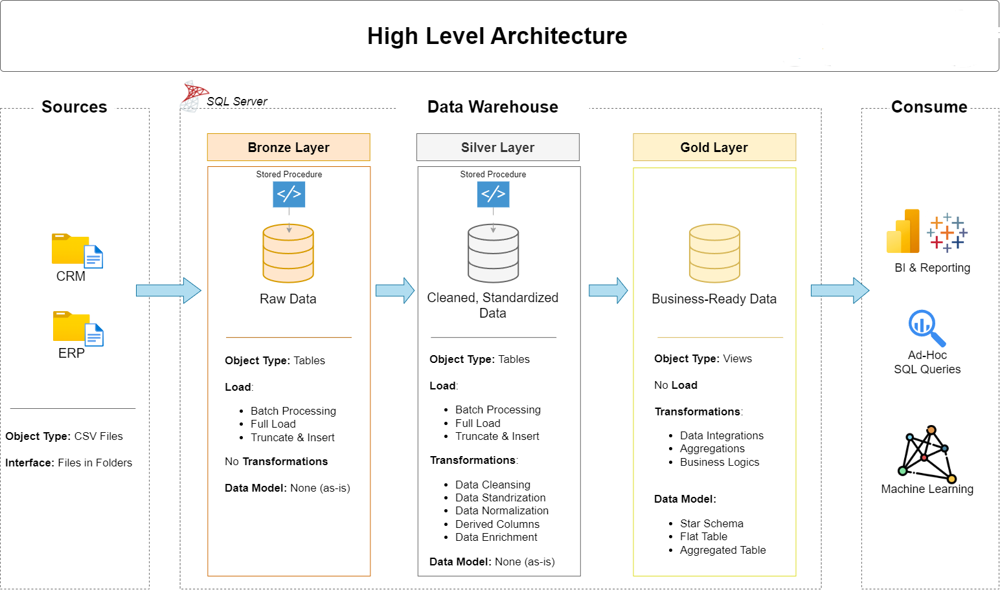
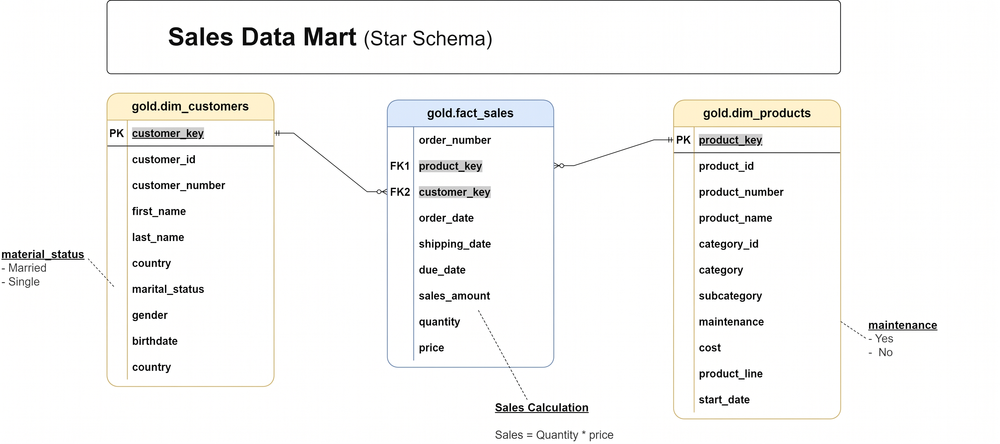

# 🚀 Data Warehouse Project

Welcome to the **Data Warehouse Project** repository!

This project demonstrates the implementation of a modern data warehouse solution using SQL Server, following industry-standard data engineering practices.

The solution includes:
- Data ingestion from multiple source systems
- ETL pipeline development
- Data cleansing and transformation
- Star schema data modeling
- Business-ready reporting layer

This project is designed to showcase practical expertise in:
- SQL Development
- Data Warehousing
- ETL Engineering
- Data Modeling

---

# 🏗️ Data Architecture

This project follows the **Medallion Architecture** approach using Bronze, Silver, and Gold layers.

<p align="center">
  
</p>

## 🔹 Bronze Layer
- Stores raw source data as-is
- Data imported from CSV files into SQL Server
- Preserves original source structure
- Used as the landing layer

## 🔹 Silver Layer
- Cleansed and standardized data
- Handles:
  - Null values
  - Duplicate records
  - Data normalization
  - Data type conversions
  - Business rule transformations

## 🔹 Gold Layer
- Business-ready analytical layer
- Implements dimensional modeling using star schema
- Contains:
  - Fact tables
  - Dimension tables
- Optimized for reporting and analytics

---

# 📖 Project Overview

## 🎯 Objective

Develop a scalable modern data warehouse using SQL Server to consolidate ERP and CRM sales data into a centralized analytical repository for business intelligence and reporting.

---

# ⚙️ Tech Stack

| Tool | Purpose |
|------|----------|
| SQL Server Express | Database Engine |
| SSMS | SQL Development & Administration |
| Draw.io | Architecture & Modeling Diagrams |
| GitHub | Version Control |
| CSV Files | Source Data |

---

# 🔄 ETL Pipeline

The ETL pipeline performs the following processes:

1. Extract data from ERP and CRM source systems
2. Load raw data into Bronze layer
3. Cleanse and standardize data in Silver layer
4. Transform data into analytical models
5. Load business-ready data into Gold layer

---

# 🧱 Data Model

The Gold Layer follows a **Star Schema** design for analytical querying and reporting.

<p align="center">
  
</p>

## ⭐ Fact Table

### `fact_sales`
Stores transactional sales data.

| Column | Description |
|---|---|
| order_number | Sales order number |
| product_key | Product surrogate key |
| customer_key | Customer surrogate key |
| order_date | Order date |
| sales_amount | Total sales amount |
| quantity | Product quantity |

---

## ⭐ Dimension Tables

### `dim_customers`

| Column | Description |
|---|---|
| customer_key | Surrogate key |
| customer_id | Source customer id |
| first_name | Customer first name |
| last_name | Customer last name |
| country | Customer country |
| gender | Customer gender |

---

### `dim_products`

| Column | Description |
|---|---|
| product_key | Surrogate key |
| product_id | Source product id |
| product_name | Product name |
| category | Product category |
| cost | Product cost |

---

# 📊 Analytics & Reporting

The warehouse enables analytical reporting such as:

- Total Sales Analysis
- Customer Insights
- Product Performance
- Revenue Trends
- Category-wise Sales
- Customer Purchase Behavior

---

# ⚡ Query Optimization

The project includes SQL optimization techniques such as:

- Surrogate Keys
- Optimized JOIN Operations
- Star Schema Modeling
- Reduced Data Redundancy

---

# 📂 Repository Structure

```bash
DataWarehouseProject/
│
├── datasets/
│   └── source csv files
│
├── scripts/
│   ├── bronze/
│   ├── silver/
│   ├── gold/
│
├── docs/
│   ├── data_catalog.md
│   ├── naming_conventions.md
│
├── images/
│   ├── data_architecture.png
│   ├── data_model.png
│   ├── etl_flow.png
│
└── README.md
```

---

# 📸 Project Screenshots

## 🏗️ Architecture Diagram

<p align="center">
  
</p>

---

## ⭐ Star Schema

<p align="center">
  
</p>

---


# 🛠️ Setup Instructions

## 1️⃣ Clone Repository

```bash
git clone https://github.com/Harish77-github/sql-data-warehouse.git
```

---

## 2️⃣ Open SQL Server Management Studio

Connect to:
- SQL Server Express
- Local SQL Instance

---

## 3️⃣ Create Database

```sql
CREATE DATABASE DataWarehouse;
```

---

## 4️⃣ Run SQL Scripts

Execute scripts in the following order:

1. Bronze Layer Scripts
2. Silver Layer Scripts
3. Gold Layer Scripts

---

# 📚 Learning Outcomes

This project demonstrates practical understanding of:

- Modern Data Warehousing
- Medallion Architecture
- ETL Pipeline Development
- SQL Query Optimization
- Indexing Strategies
- Dimensional Modeling
- Star Schema Design

---

# 🚀 Future Improvements Planned

- Power BI Dashboard Integration
- Incremental Data Loading
- Stored Procedures for ETL
- Data Quality Monitoring
- Cloud Deployment (Azure / AWS)
- Automated Scheduling

---
